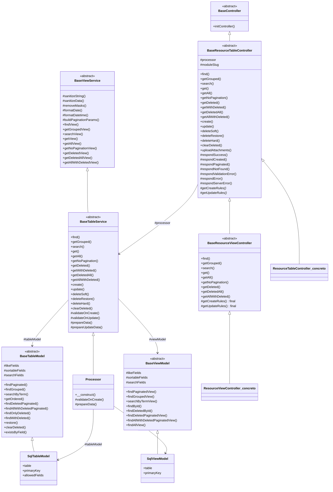

# Arquitetura do Backend — Projeto55100

> CodeIgniter 4 — PHP 8.2 — MySQL/MariaDB — API REST `/api/v1/...`

---

## Sumário

1. [Visão Geral](#1-visão-geral)
2. [Hierarquia de Controllers](#2-hierarquia-de-controllers)
3. [Hierarquia de Services (Processors)](#3-hierarquia-de-services-processors)
4. [Hierarquia de Models](#4-hierarquia-de-models)
5. [Requests — Validação de Entrada](#5-requests--validação-de-entrada)
6. [Filters — Middlewares](#6-filters--middlewares)
7. [Libraries — Componentes Transversais](#7-libraries--componentes-transversais)
8. [Rotas](#8-rotas)
9. [Segurança e Ofuscação](#9-segurança-e-ofuscação)
10. [Fluxo de uma Requisição Típica](#10-fluxo-de-uma-requisicao-típica)
11. [Padrão de Criação de Novo Módulo](#11-padrão-de-criação-de-novo-módulo)
12. [Diagrama de Classes](#12-diagrama-de-classes)

---

## 1. Visão Geral

O backend segue uma arquitetura em **camadas de abstração progressiva**:

```
Request HTTP → Nginx → PHP-FPM → Controller → Service (Processor) → Model → MySQL
                                      │
                            Requests (validação)
                                      │
                            Filters (middleware JWT)
```

Cada camada tem responsabilidade única e bem definida:

| Camada              | Diretório             | Responsabilidade                                            |
| ------------------- | --------------------- | ----------------------------------------------------------- |
| Controller          | `Controllers/Api/V1/` | Orquestrar request/response, delegar ao Processor           |
| Service (Processor) | `Services/V1/`        | Regras de negócio, validação semântica, preparação de dados |
| Model               | `Models/V1/`          | Acesso ao banco (SQL), consultas estruturadas               |
| Request             | `Requests/V1/`        | Regras de validação de entrada (formato dos campos)         |
| Filter              | `Filters/V1/`         | Middleware (autenticação, rate limiting)                    |
| Library             | `Libraries/`          | Utilitários transversais (JWT, upload)                      |

**Princípio fundamental:** Toda lógica comum a mais de um módulo DEVE estar nas classes base. Nunca duplicar código entre módulos.

---

## 2. Hierarquia de Controllers

```
Controller (CodeIgniter\Core)
  └── App\Controllers\BaseController
       └── App\Controllers\Api\V1\BaseResourceTableController   ← CLASSE MÃE
            ├── 14+ endpoints REST completos
            ├── Helpers de resposta padronizados
            ├── Upload de anexos
            ├── Parsing inteligente de request body
            │
            └── App\Controllers\Api\V1\BaseResourceViewController  ← Somente leitura
                 ├── 8 endpoints de leitura (view SQL)
                 ├── Bloqueia create/update (final)
                 └── Herda helpers de resposta da classe mãe
```

### 2.1 `BaseResourceTableController`

**Arquivo:** `Controllers/Api/V1/BaseResourceTableController.php`

Classe **abstrata** que fornece **TODO** o conjunto de endpoints REST para qualquer módulo com tabela física. Nenhum controller filho precisa (nem deve) reimplementar esses métodos.

#### Endpoints de Leitura (Tabela)

| Método | Endpoint                     | Descrição                         | Parâmetros                                                         |
| ------ | ---------------------------- | --------------------------------- | ------------------------------------------------------------------ |
| POST   | `/find`                      | Filtros exatos com paginação      | Body: `{ "campo": "valor" }` + Query: `?page=&limit=&sort=&order=` |
| POST   | `/get-grouped`               | WHERE IN com paginação            | Body: `{ "coluna": ["v1","v2"] }`                                  |
| GET    | `/search`                    | Busca textual LIKE OR             | `?q=termo&page=&limit=`                                            |
| GET    | `/get/{id}`                  | Registro por ID                   | ID na URL                                                          |
| GET    | `/get-all`                   | Listagem paginada                 | `?page=&limit=&sort=&order=`                                       |
| GET    | `/get-no-pagination`         | Sem paginação                     | `?sort=&order=&limit=` (limit opcional)                            |
| GET    | `/get-deleted/{id}`          | Soft-deleted por ID               | ID na URL                                                          |
| GET    | `/get-with-deleted/{id}`     | Ativo ou deletado                 | ID na URL                                                          |
| GET    | `/get-deleted-all`           | Todos soft-deleted paginado       | `?page=&limit=&sort=&order=`                                       |
| GET    | `/get-all-with-deleted/{id}` | Busca por ID (ativo+deletado)     | ID na URL                                                          |
| GET    | `/get-all-with-deleted`      | Todos (ativos+deletados) paginado | `?page=&limit=&sort=&order=`                                       |

#### Endpoints de Escrita

| Método | Endpoint       | Descrição                                         |
| ------ | -------------- | ------------------------------------------------- |
| POST   | `/create`      | Criar registro (valida → sanitiza → insere)       |
| PUT    | `/update/{id}` | Atualizar registro (valida → sanitiza → atualiza) |

#### Endpoints de Exclusão

| Método | Endpoint               | Descrição                                 |
| ------ | ---------------------- | ----------------------------------------- |
| DELETE | `/delete-soft/{id}`    | Soft delete (marca deleted_at)            |
| PATCH  | `/delete-restore/{id}` | Restaura soft delete                      |
| DELETE | `/delete-hard/{id}`    | Hard delete (remove do banco)             |
| DELETE | `/clear-deleted`       | Remove todos soft-deleted permanentemente |
| DELETE | `/clear-deleted/{id}`  | Remove soft-deleted específico            |

#### Upload de Anexos

| Método | Endpoint                         | Descrição                      |
| ------ | -------------------------------- | ------------------------------ |
| POST   | `/upload-files/{id}`             | Upload de arquivos (multipart) |

Ativação por módulo: `protected string $moduleSlug = 'nome-do-modulo';` + rota.

#### Helpers de Resposta

Métodos padronizados que **sempre** devem ser usados (nunca recriar):

| Método                                 | Código HTTP | Uso                                     |
| -------------------------------------- | ----------- | --------------------------------------- |
| `respondSuccess($data, $msg)`          | 200         | Sucesso genérico                        |
| `respondCreated($data)`                | 201         | Criação bem-sucedida                    |
| `respondPaginated($data, $pagination)` | 200         | Listagem paginada                       |
| `respondNotFound($msg)`                | 404         | Registro não encontrado                 |
| `respondValidationError($errors)`      | 422         | Erro de validação                       |
| `respondError($msg, $code)`            | 400+        | Erro de negócio                         |
| `respondServerError($e)`               | 500         | Erro interno (com debug em development) |

#### Formato de Resposta Padrão

```json
{
  "method": "GET",
  "endpoint": "/api/v1/...",
  "statusCode": 200,
  "message": "Operação realizada com sucesso",
  "success": true,
  "data": { ... },
  "pagination": {
    "page": 1,
    "limit": 20,
    "total": 100,
    "pages": 5
  }
}
```

#### Hooks Obrigatórios (abstratos)

Controllers filho DEVEM implementar:

```php
abstract protected function getCreateRules(): array;
abstract protected function getUpdateRules(): array;
```

#### Request Body — Parsing Inteligente

O método `getRequestBody()` resolve automaticamente:

- `application/json` → `getJSON(true)`
- `PUT/PATCH` com `multipart/form-data` → parse manual do `php://input`
- Demais casos → `getPost()`

Inclui suporte a extração de arquivos em PUT/PATCH multipart via `parsePutMultipartBody()`.

---

### 2.2 `BaseResourceViewController`

**Arquivo:** `Controllers/Api/V1/BaseResourceViewController.php`

Estende `BaseResourceTableController` para oferecer **somente leitura** sobre views SQL. Redefine cada endpoint de leitura para operar sobre `$this->processor->*View()`.

#### Endpoints Disponíveis (leitura)

| Método | Endpoint                | Método no Service         |
| ------ | ----------------------- | ------------------------- |
| POST   | `/find`                 | `findView()`              |
| POST   | `/get-grouped`          | `getGroupedView()`        |
| GET    | `/search`               | `searchView()`            |
| GET    | `/get/{id}`             | `getView()`               |
| GET    | `/get-all`              | `getAllView()`            |
| GET    | `/get-no-pagination`    | `getNoPaginationView()`   |
| GET    | `/get-deleted/{id}`     | `getDeletedView()`        |
| GET    | `/get-deleted-all`      | `getDeletedAllView()`     |
| GET    | `/get-all-with-deleted` | `getAllWithDeletedView()` |

#### Hooks Selados

`getCreateRules()` e `getUpdateRules()` são `final` e retornam `[]` — impossível criar ou atualizar via view controller.

### 2.3 Controllers de Módulo (exemplos concretos)

Cada controller filho é **anêmico** — contém apenas:

```php
class ResourceTableController extends BaseResourceTableController
{
    public function initController(...): void {
        parent::initController($request, $response, $logger);
        $this->processor = new Processor();  // ← única linha de lógica
    }

    protected function getCreateRules(): array {
        return (new CreateRequest())->rules();  // ← delega para Request
    }

    protected function getUpdateRules(): array {
        return (new UpdateRequest())->rules();  // ← delega para Request
    }
}
```

Módulos existentes:

| Grupo   | Módulo                          | Tipo          | View                                    |
| ------- | ------------------------------- | ------------- | --------------------------------------- |
| Eleicao | `MunicipioIbgeTse`              | Tabela        | —                                       |
| Eleicao | `MunicipioRJ`                   | Tabela + View | `view_municipio_RJ`                     |
| Eleicao | `MandatarioRJ`                  | Tabela + View | `mandatario_RJ` (tabela lida como view) |
| Eleicao | `Candidato2022RJ`               | Tabela        | —                                       |
| Eleicao | `Candidato2024RJ`               | Tabela        | —                                       |
| Eleicao | `Partidos2022RJ`                | Tabela        | —                                       |
| Eleicao | `Partidos2024RJ`                | Tabela        | —                                       |
| Eleicao | `VotacaoCandidatoMunzona2022RJ` | View          | —                                       |
| Eleicao | `VotacaoCandidatoMunzona2024RJ` | View          | —                                       |
| Eleicao | `VotosMunicipio2022`            | Tabela        | —                                       |
| Eleicao | `VotosMunicipio2024RJ`          | Tabela        | —                                       |
| User    | `AuthUser`                      | View          | `view_auth_user`                        |
| User    | `UserUsers`                     | Tabela        | —                                       |
| User    | `UserProfiles`                  | Tabela        | —                                       |
| User    | `UserSaasTenants`               | Tabela        | —                                       |
| User    | `UserTenants`                   | Tabela + View | —                                       |
| User    | `UserPasswordResets`            | Tabela        | —                                       |
| User    | `UserPasswordResetTokens`       | Tabela        | —                                       |
| User    | `UserActionLogs`                | Tabela        | —                                       |
| User    | `UserUserData`                  | Tabela        | —                                       |

---

## 3. Hierarquia de Services (Processors)

```
App\Services\V1\BaseViewService   ← Utilitários + leitura de view
  └── App\Services\V1\BaseTableService  ← Leitura de tabela + Escrita (Template Method) + Exclusão
        └── {Modulo}\Processor          ← Hooks de validação e preparação específicos
```

### 3.1 `BaseViewService`

**Arquivo:** `Services/V1/BaseViewService.php`

Classe **abstrata** base para todos os services. Fornece:

#### Utilitários

| Método                                | Descrição                                                 |
| ------------------------------------- | --------------------------------------------------------- |
| `sanitizeString(string): string`      | Remove tags HTML e espaços extras                         |
| `sanitizeData(array): array`          | Sanitiza array removendo nulos/vazios                     |
| `removeMasks(array): array`           | Remove máscaras de CPF, telefone, CEP (mantém só dígitos) |
| `formatDate(?string): ?string`        | Formata para `Y-m-d`                                      |
| `formatDatetime(?string): ?string`    | Formata para `Y-m-d H:i:s`                                |
| `buildPaginationParams(array): array` | Normaliza page/limit/sort/order com limites seguros       |

**Campos com máscara** (definidos em `MASKED_FIELDS`):
`cpf`, `whatsapp`, `phone`, `zip_code`, `uc_cpf`, `uc_whatsapp`, `uc_phone`, `uc_zip_code`

#### Leitura de View

| Método                    | Endpoint                    | Model alvo                                     |
| ------------------------- | --------------------------- | ---------------------------------------------- |
| `findView()`              | POST `/find`                | `viewModel->findPaginatedView()`               |
| `getGroupedView()`        | POST `/get-grouped`         | `viewModel->findGroupedView()`                 |
| `searchView()`            | GET `/search`               | `viewModel->searchByTermView()`                |
| `getView()`               | GET `/get/{id}`             | `viewModel->findById()`                        |
| `getAllView()`            | GET `/get-all`              | `viewModel->findPaginatedView()`               |
| `getNoPaginationView()`   | GET `/get-no-pagination`    | `viewModel->findAllView()`                     |
| `getDeletedView()`        | GET `/get-deleted/{id}`     | `viewModel->findDeletedById()`                 |
| `getDeletedAllView()`     | GET `/get-deleted-all`      | `viewModel->findDeletedPaginatedView()`        |
| `getAllWithDeletedView()` | GET `/get-all-with-deleted` | `viewModel->findAllWithDeletedPaginatedView()` |

### 3.2 `BaseTableService`

**Arquivo:** `Services/V1/BaseTableService.php`

Estende `BaseViewService`. Adiciona:

#### Leitura de Tabela

| Método                | Endpoint                         | Model alvo                                                         |
| --------------------- | -------------------------------- | ------------------------------------------------------------------ |
| `find()`              | POST `/find`                     | `tableModel->findPaginated()`                                      |
| `getGrouped()`        | POST `/get-grouped`              | `tableModel->findGrouped()`                                        |
| `search()`            | GET `/search`                    | `tableModel->searchByTerm()`                                       |
| `get()`               | GET `/get/{id}`                  | `tableModel->find()`                                               |
| `getAll()`            | GET `/get-all`                   | `tableModel->findPaginated()`                                      |
| `getNoPagination()`   | GET `/get-no-pagination`         | `tableModel->getOrdered()`                                         |
| `getDeleted()`        | GET `/get-deleted/{id}`          | `tableModel->findOnlyDeleted()`                                    |
| `getWithDeleted()`    | GET `/get-with-deleted/{id}`     | `tableModel->findWithDeleted()`                                    |
| `getDeletedAll()`     | GET `/get-deleted-all`           | `tableModel->findDeletedPaginated()`                               |
| `getAllWithDeleted()` | GET `/get-all-with-deleted/{id}` | `tableModel->findWithDeleted()` ou `findAllWithDeletedPaginated()` |

#### Escrita — Template Method

```
create($data):
  1. sanitizeData()  → remove tags HTML, espaços
  2. removeMasks()   → remove máscaras de campos
  3. validateOnCreate()  → HOOK: validação semântica (unicidade, FK)
  4. prepareData()       → HOOK: transformações (hash de senha)
  5. tableModel->insert()

update($id, $data):
  1. tableModel->find() → verifica existência
  2. sanitizeData() + removeMasks()
  3. prepareUpdateData() → HOOK: remove campos imutáveis
  4. validateOnUpdate()  → HOOK: unicidade com excludeId
  5. tableModel->update()
```

#### Hooks Sobrescrevíveis (Template Method)

```php
/**
 * Validar antes do create. Retornar ['success'=>false, 'message'=>..., 'code'=>...]
 * ou null para prosseguir.
 */
protected function validateOnCreate(array $data): ?array

/**
 * Validar antes do update.
 */
protected function validateOnUpdate(int $id, array $data): ?array

/**
 * Preparar dados antes do insert (ex.: bcrypt na senha).
 */
protected function prepareData(array $data): array

/**
 * Preparar dados antes do update (ex.: remover campos imutáveis).
 * Por padrão delega para prepareData().
 */
protected function prepareUpdateData(int $id, array $data): array
```

#### Exclusão

| Método               | Descrição                         | Validação                  |
| -------------------- | --------------------------------- | -------------------------- |
| `deleteSoft($id)`    | Marca `deleted_at`                | Rejeita se já deletado     |
| `deleteRestore($id)` | Zera `deleted_at`                 | Requer que esteja deletado |
| `deleteHard($id)`    | `DELETE` físico                   | Rejeita se não existir     |
| `clearDeleted($id)`  | Remove todos (ou um) soft-deleted | —                          |

### 3.3 Processors de Módulo (exemplos concretos)

#### `Eleicao\MunicipioIbgeTse\Processor`

```php
class Processor extends BaseTableService
{
    public function __construct()
    {
        $this->tableModel = new SqlTableModel();
    }

    protected function prepareUpdateData(int $id, array $data): array
    {
        unset($data['cd_ibge']); // PK imutável
        return $data;
    }
}
```

- **Sem view, sem soft delete** — o mais simples possível.

#### `Eleicao\MandatarioRJ\Processor`

```php
class Processor extends BaseTableService
{
    public function __construct()
    {
        $this->tableModel = new SqlTableModel();
        $this->viewModel  = new SqlViewModel(); // ← tabela lida como view
    }

    protected function prepareData(array $data): array
    {
        if (!empty($data['dt_nascimento'])) {
            $data['dt_nascimento'] = $this->formatDate($data['dt_nascimento']);
        }
        return $data;
    }

    protected function prepareUpdateData(int $id, array $data): array
    {
        return $this->prepareData($data);
    }
}
```

- **Tabela + View** (service trata ambos).
- Formata data de nascimento antes de persistir.

#### `User\UserUsers\Processor`

```php
class Processor extends BaseTableService
{
    public function __construct()
    {
        $this->tableModel = new SqlTableModel();
    }

    protected function validateOnCreate(array $data): ?array
    {
        if (!empty($data['email']) && $this->tableModel->existsByEmail($data['email']))
            return ['success' => false, 'message' => 'E-mail já cadastrado', 'code' => 409];
        // ... username
    }

    protected function validateOnUpdate(int $id, array $data): ?array
    {
        if (!empty($data['email']) && $this->tableModel->existsByEmail($data['email'], $id))
            return ['success' => false, 'message' => 'E-mail já cadastrado', 'code' => 409];
        // ...
    }

    protected function prepareData(array $data): array
    {
        if (!empty($data['password_hash']))
            $data['password_hash'] = password_hash($data['password_hash'], PASSWORD_BCRYPT);
        return $data;
    }

    protected function prepareUpdateData(int $id, array $data): array
    {
        unset($data['password_hash']); // senha não se altera por update direto
        return $data;
    }
}
```

- **Validação de unicidade** (email + username).
- **Hash bcrypt** na criação.
- **Bloqueio de alteração de senha** via update direto.

---

## 4. Hierarquia de Models

```
CodeIgniter\Model
  ├── App\Models\V1\BaseTableModel  ← Leitura/escrita em tabelas físicas
  └── App\Models\V1\BaseViewModel  ← Leitura em views SQL
```

### 4.1 `BaseTableModel`

**Arquivo:** `Models/V1/BaseTableModel.php`

Estende `Model` do CI4. Adiciona métodos de consulta estruturados:

#### Propriedades a declarar nas classes filhas

```php
protected $DBGroup          = DB_GROUP_001;     // Grupo de conexão
protected $table            = 'nome_da_tabela';
protected $primaryKey       = 'id';
protected $useAutoIncrement = true;
protected $useSoftDeletes   = true;             // false se não tiver deleted_at
protected $useTimestamps    = true;             // false se não tiver created_at/updated_at
protected $allowedFields    = ['campo1', 'campo2'];

protected array $likeFields     = ['campo_like1'];  // LIKE %valor% no find
protected array $sortableFields = ['campo1'];       // ORDER BY seguro
public array $searchFields      = ['campo1'];       // OR LIKE na busca textual
```

#### Métodos de Consulta

| Método                                                  | Descrição                         |
| ------------------------------------------------------- | --------------------------------- |
| `findPaginated(filters, page, limit, sort, order)`      | Filtros exatos/LIKE com paginação |
| `findGrouped(multiFilters, page, limit, sort, order)`   | WHERE IN com paginação            |
| `searchByTerm(term, fields, page, limit, sort, order)`  | OR LIKE textual paginado          |
| `getOrdered(sort, order, ?limit)`                       | Ordenado sem paginação            |
| `findDeletedPaginated(page, limit, sort, order)`        | Soft-deleted paginado             |
| `findAllWithDeletedPaginated(page, limit, sort, order)` | Todos (ativos+deletados) paginado |
| `findOnlyDeleted(id)`                                   | Soft-deleted por ID               |
| `findWithDeleted(id)`                                   | Ativo ou deletado por ID          |
| `restore(id)`                                           | Restaura soft delete              |
| `clearDeleted(?id)`                                     | Remove permanentemente            |
| `existsByField(field, value, ?excludeId)`               | Verifica unicidade                |

#### Segurança

- `safeSort()` — só permite campos listados em `$sortableFields`
- `safeOrder()` — só permite `asc` ou `desc`
- `applyActiveScopeToBuilder()` — adiciona `WHERE deleted_at IS NULL` automaticamente quando soft delete ativo

### 4.2 `BaseViewModel`

**Arquivo:** `Models/V1/BaseViewModel.php`

Model para **leitura exclusiva** de views SQL. Não tem `$allowedFields` (read-only).

#### Métodos de Consulta

| Método                                                      | Descrição                         |
| ----------------------------------------------------------- | --------------------------------- |
| `findPaginatedView(filters, page, limit, sort, order)`      | Filtros exatos/LIKE com paginação |
| `findGroupedView(multiFilters, page, limit, sort, order)`   | WHERE IN com paginação            |
| `searchByTermView(term, page, limit, sort, order)`          | OR LIKE textual paginado          |
| `findById(id)`                                              | Registro ativo por ID             |
| `findDeletedById(id)`                                       | Soft-deleted por ID               |
| `findDeletedPaginatedView(page, limit, sort, order)`        | Soft-deleted paginado             |
| `findAllWithDeletedPaginatedView(page, limit, sort, order)` | Todos paginado                    |
| `findAllView(sort, order, ?limit)`                          | Ordenado sem paginação            |

### 4.3 Models de Módulo (exemplos concretos)

#### `Eleicao\MunicipioIbgeTse\SqlTableModel`

```php
class SqlTableModel extends BaseTableModel
{
    protected $DBGroup          = DB_GROUP_001;
    protected $table            = 'municipio_ibge_tse';
    protected $primaryKey       = 'cd_ibge';
    protected $useAutoIncrement = false;  // PK char(7), não auto
    protected $useSoftDeletes   = false;  // sem soft delete
    protected $useTimestamps    = false;  // sem timestamps

    protected $allowedFields = ['cd_ibge', 'cd_tse', 'nm_cidade'];

    protected array $likeFields     = ['cd_ibge', 'cd_tse', 'nm_cidade'];
    protected array $sortableFields = ['cd_ibge', 'cd_tse', 'nm_cidade'];
    public array $searchFields      = ['cd_ibge', 'cd_tse', 'nm_cidade'];
}
```

#### `User\UserUsers\SqlTableModel`

```php
class SqlTableModel extends BaseTableModel
{
    protected $DBGroup        = DB_GROUP_001;
    protected $table          = 'user_users';
    protected $primaryKey     = 'id';
    protected $useSoftDeletes = true;
    protected $useTimestamps  = true;

    protected $hidden = ['password_hash'];  // ← nunca retorna nas queries

    protected $allowedFields = [
        'profile_id', 'username', 'email', 'password_hash',
        'status', 'last_login_at',
    ];

    protected array $likeFields     = ['username', 'email'];
    protected array $sortableFields = ['id', 'profile_id', 'username', 'email', 'status', ...];
    public array $searchFields      = ['username', 'email'];

    public function existsByEmail(string $email, ?int $excludeId = null): bool
    {
        return $this->existsByField('email', $email, $excludeId);
    }

    public function existsByUsername(string $username, ?int $excludeId = null): bool
    {
        return $this->existsByField('username', $username, $excludeId);
    }
}
```

#### `Eleicao\MandatarioRJ\SqlViewModel`

```php
class SqlViewModel extends BaseViewModel
{
    protected $DBGroup    = DB_GROUP_001;
    protected $table      = 'mandatario_RJ';   // ← lê direto da tabela, não de view
    protected $primaryKey = 'id';

    protected array $likeFields     = ['nome_politico', 'cargo_politico', 'partido_politico', ...];
    protected array $sortableFields = ['id', 'nome_politico', 'cargo_politico', ...];
    public array $searchFields      = ['nome_politico', 'cargo_politico', 'partido_politico', ...];
}
```

---

## 5. Requests — Validação de Entrada

**Diretório:** `Requests/V1/{Grupo}/{Modulo}/`

Cada módulo tem dois arquivos:

### `CreateRequest.php`

```php
class CreateRequest
{
    public function rules(): array
    {
        return [
            'cd_ibge'   => 'required|string|max_length[7]',
            'cd_tse'    => 'permit_empty|string|max_length[5]',
            'nm_cidade' => 'required|string|max_length[100]',
        ];
    }

    public function messages(): array
    {
        return [
            'cd_ibge' => [
                'required'   => 'O campo cd_ibge é obrigatório',
                'max_length' => 'O cd_ibge não pode exceder 7 caracteres',
            ],
            // ...
        ];
    }
}
```

### `UpdateRequest.php`

Mesma estrutura, com regras para o update (pode ser mais permissiva).

---

## 6. Filters — Middlewares

**Diretório:** `Filters/V1/Auth/`

### `AuthFilter.php`

Filtro de autenticação JWT (Bearer token).

- **before():** Extrai token do header `Authorization`, decodifica via `JwtHelper::decode()`, verifica revogação em cache.
- **Retorna 401** se token ausente, inválido, expirado ou revogado.

### `LoginRateLimitFilter.php`

Rate limiting para login.

- **10 tentativas por minuto** por IP.
- **Retorna 429** com header `Retry-After`.

> **Nota:** Ambos os filtros existem como classes mas **não estão registrados** em `Config/Filters.php` atualmente.

---

## 7. Libraries — Componentes Transversais

**Diretório:** `Libraries/`

### `JwtHelper`

Implementação **pura PHP** de JWT HS256 — sem dependências externas.

```php
JwtHelper::encode($payload, $ttl = 36000): string  // Gera token
JwtHelper::decode($token): array                     // Valida e retorna payload
```

- Algoritmo: HMAC-SHA256 (HS256)
- Payload: `iat` + `exp` + dados do usuário
- Segredo: constante ofuscada `E61E7DE603852182385DA5E907B4B232` (definida em `Puipuia.php`) → fallback para `JWT_SECRET` (`.env`)

### `FileUploadLibrary`

Upload de arquivos multi-módulo com isolamento multi-tenant.

```php
$lib    = new FileUploadLibrary();
$result = $lib->upload($entityId, $moduleSlug, $files, $constraints, $tenantId);
```

- Estrutura de diretórios: `writable/uploads/Projeto56300App/{module_table}/usu_{id}/{moduleSlug}/`
- Validação de tipo (MIME), tamanho, categoria

---

## 8. Rotas

**Arquivo central:** `Config/Routes.php`

Agrupamento: `/api/v1`

Cada módulo tem seu arquivo de rotas em:
`Config/Routes/Api/v1/{Grupo}/{Modulo}/`

### `EndpointTable.php` — 16 rotas

```php
$routes->post('find',              '...ResourceTableController::find');
$routes->post('get-grouped',       '...ResourceTableController::getGrouped');
$routes->get('search',             '...ResourceTableController::search');
$routes->get('get/(:num)',         '...ResourceTableController::get/$1');
$routes->get('get-all',            '...ResourceTableController::getAll');
$routes->get('get-no-pagination',  '...ResourceTableController::getNoPagination');
$routes->get('get-deleted/(:num)', '...ResourceTableController::getDeleted/$1');
$routes->get('get-with-deleted/(:num)', '...ResourceTableController::getWithDeleted/$1');
$routes->get('get-deleted-all',    '...ResourceTableController::getDeletedAll');
$routes->get('get-all-with-deleted/(:num)', '...ResourceTableController::getAllWithDeleted/$1');
$routes->get('get-all-with-deleted', '...ResourceTableController::getAllWithDeleted');
$routes->post('create',            '...ResourceTableController::create');
$routes->put('update/(:num)',      '...ResourceTableController::update/$1');
$routes->delete('delete-soft/(:num)', '...ResourceTableController::deleteSoft/$1');
$routes->patch('delete-restore/(:num)', '...ResourceTableController::deleteRestore/$1');
$routes->delete('delete-hard/(:num)', '...ResourceTableController::deleteHard/$1');
$routes->delete('clear-deleted',   '...ResourceTableController::clearDeleted');
$routes->delete('clear-deleted/(:num)', '...ResourceTableController::clearDeleted/$1');
```

### `EndPointView.php` — 8 rotas (leitura apenas)

```php
$routes->post('find',              '...ResourceViewController::find');
$routes->post('get-grouped',       '...ResourceViewController::getGrouped');
$routes->get('search',             '...ResourceViewController::search');
$routes->get('get/(:num)',         '...ResourceViewController::get/$1');
$routes->get('get-all',            '...ResourceViewController::getAll');
$routes->get('get-no-pagination',  '...ResourceViewController::getNoPagination');
$routes->get('get-deleted/(:num)', '...ResourceViewController::getDeleted/$1');
$routes->get('get-deleted-all',    '...ResourceViewController::getDeletedAll');
```

---

## 9. Segurança e Ofuscação

### 9.1 Constantes Ofuscadas

Em `Config/Constants.php`:

```php
require_once dirname(__DIR__, 2) . base64_decode('L3N5c3RlbS9UaGlyZFBhcnR5L0p1Z3dva28ucGhw');
require_once dirname(__DIR__, 2) . Beschermd('L3N5c3RlbS9Ib3RSZWxvYWRlci9QdWlwdWlhLnBocA==');
```

Esses arquivos carregam constantes hexadecimais ofuscadas usadas em `Config/Database.php` para as credenciais do banco e em `Libraries/JwtHelper.php` para o segredo JWT.

### 9.2 DB_GROUP_001 Dinâmico

```php
if ($_SERVER['SERVER_NAME'] === 'habilidade.com') {
    define('DB_GROUP_001', 'habilidade');        // produção
} else {
    define('DB_GROUP_001', 'codeigniter55100_mysql');  // local/docker
}
```

### 9.3 Soft Delete + $hidden

- Campos `deleted_at` gerenciados automaticamente pelo Model.
- `$hidden = ['password_hash']` no `UserUsers\SqlTableModel` — nunca exposto em respostas.

### 9.4 Proteção SQL Injection

- `safeSort()` — whitelist de campos em `$sortableFields`
- `safeOrder()` — só `asc` ou `desc`
- Parâmetros passados via Query Builder do CI4 (escapamento automático)

---

## 10. Fluxo de uma Requisição Típica

### Exemplo: GET `/api/v1/mandatario-rj/get-all?page=1&limit=20`

```
1. Nginx recebe /api/v1/mandatario-rj/get-all
   → proxy para php:9000 (PHP-FPM)

2. CI4 Router resolve a rota
   → Config/Routes/Api/v1/Eleicao/MandatarioRJ/EndpointTable.php
   → Api\V1\Eleicao\MandatarioRJ\ResourceTableController::getAll

3. BaseResourceTableController::getAll()
   → Extrai pagination params da query string
   → Chama $this->processor->getAll($params)

4. BaseTableService::getAll()
   → buildPaginationParams($params) → normaliza page=1, limit=20, sort=id, order=desc
   → $this->tableModel->findPaginated([], 1, 20, 'id', 'desc')

5. BaseTableModel::findPaginated()
   → Constrói: SELECT * FROM mandatario_RJ WHERE deleted_at IS NULL
     ORDER BY id DESC LIMIT 20 OFFSET 0
   → Retorna { data: [...], pagination: { page, limit, total, pages } }

6. BaseResourceTableController::respondPaginated()
   → Monta envelope JSON padronizado
   → Retorna ResponseInterface com status 200

7. Response viaja de volta: PHP-FPM → Nginx → Cliente
```

### Exemplo: POST `/api/v1/user-users/create`

```
1. Nginx → PHP-FPM → CI4 Router → ResourceTableController::create()

2. BaseResourceTableController::create()
   → validate(getCreateRules())  ← CreateRequest::rules()
   → processor->create($requestBody)

3. UserUsersProcessor::create() [herdado de BaseTableService]
   → sanitizeData($data)         ← remove tags HTML
   → removeMasks($data)          ← remove máscaras de CPF/telefone
   → validateOnCreate($data)     ← verifica unicidade de email e username
   → prepareData($data)          ← aplica password_hash($password, PASSWORD_BCRYPT)
   → tableModel->insert($data)
   → Retorna { success: true, data: { ... } }

4. BaseResourceTableController::respondCreated($data)
   → 201 + envelope JSON
```

---

## 11. Padrão de Criação de Novo Módulo

Para adicionar um novo módulo com **tabela + view**, criar:

```
Controllers/Api/V1/{Grupo}/{Modulo}/
├── ResourceTableController.php     ← extends BaseResourceTableController
└── ResourceViewController.php      ← extends BaseResourceViewController (opcional)

Services/V1/{Grupo}/{Modulo}/
└── Processor.php                   ← extends BaseTableService

Models/V1/{Grupo}/{Modulo}/
├── SqlTableModel.php               ← extends BaseTableModel
└── SqlViewModel.php                ← extends BaseViewModel (opcional)

Requests/V1/{Grupo}/{Modulo}/
├── CreateRequest.php               ← rules() + messages()
└── UpdateRequest.php               ← rules() + messages()

Config/Routes/Api/v1/{Grupo}/{Modulo}/
├── EndpointTable.php               ← 16 rotas
└── EndPointView.php                ← 8 rotas (opcional)
```

E em `Config/Routes.php`: adicionar o `require` do grupo.

---

## 12. Diagrama de Classes



---

> **Documentação gerada em 2026-07-04.** Mantenha este arquivo atualizado conforme novas abstrações forem criadas.
