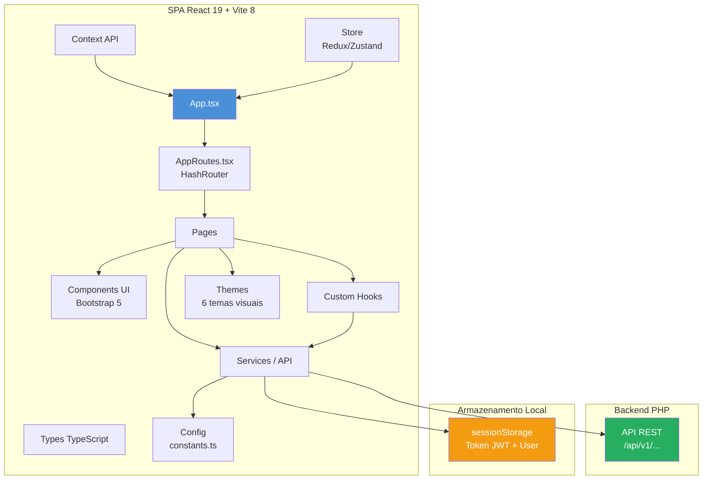

[← Voltar ao índice principal (README.md)](../../README.md)

---

# Arquitetura do Frontend — Projeto55100

> React 19 + Vite 8 + TypeScript 6 — Bootstrap 5.3 — SPA desacoplada

---

## Sumário

1. [Visão Geral](#1-visão-geral)
2. [Estrutura de Diretórios](#2-estrutura-de-diretórios)
3. [Roteamento](#3-roteamento)
4. [Camada de Serviços (API)](#4-camada-de-serviços-api)
5. [Camada de Páginas](#5-camada-de-páginas)
6. [Componentes de UI](#6-componentes-de-ui)
7. [Hooks Compartilhados](#7-hooks-compartilhados)
8. [Context API](#8-context-api)
9. [Store (Estado Global)](#9-store-estado-global)
10. [Temas Visuais](#10-temas-visuais)
11. [Autenticação e Sessão](#11-autenticação-e-sessão)
12. [Configuração (constants.ts)](#12-configuração-constantsts)
13. [Vite Configuration](#13-vite-configuration)
14. [Fluxo de uma Requisição Típica](#14-fluxo-de-uma-requisição-típica)
15. [Diagrama de Arquitetura](#15-diagrama-de-arquitetura)
16. [Padrão de Criação de Nova Feature](#16-padrão-de-criação-de-nova-feature)

---

## 1. Visão Geral

O frontend é uma **SPA (Single Page Application)** construída com **React 19**, compilada com **Vite 8**, escrita em **TypeScript 6** e estilizada com **Bootstrap 5.3.8**.

```
┌──────────────────────────────────────────────────────────────┐
│                    SPA React 19 + Vite 8                      │
│                                                              │
│  ┌─────────┐  ┌──────────┐  ┌──────────┐  ┌─────────────┐  │
│  │ Routes  │→ │  Pages   │→ │ Services │→ │ API REST    │  │
│  │ (Router)│  │(Lista/   │  │(fetch +  │  │ (/api/v1/)  │  │
│  │         │  │ Form)    │  │ Bearer)  │  │ Backend PHP │  │
│  └─────────┘  └──────────┘  └──────────┘  └─────────────┘  │
│       │            │              │                          │
│       ▼            ▼              ▼                          │
│  ┌─────────┐  ┌──────────┐  ┌─────────────┐                │
│  │Contexts │  │Components│  │ Hooks       │                │
│  │(Auth,   │  │(Bootstrap│  │ (useForm,   │                │
│  │ Theme)  │  │ 5 Wraps) │  │ useDebounce)│                │
│  └─────────┘  └──────────┘  └─────────────┘                │
│                                                              │
│  ┌──────────┐  ┌──────────┐  ┌──────────┐                  │
│  │ Store    │  │ Themes   │  │ Types    │                  │
│  │ (Redux/  │  │ (6 temas)│  │ (TS)     │                  │
│  │ Zustand) │  │          │  │          │                  │
│  └──────────┘  └──────────┘  └──────────┘                  │
└──────────────────────────────────────────────────────────────┘
         │
         │ HTTP (fetch) com Bearer Token
         ▼
┌──────────────────────────────────────────────────────────────┐
│              Backend PHP — API REST /api/v1/...              │
└──────────────────────────────────────────────────────────────┘
```

**Princípios fundamentais:**

- **SPA desacoplada** — zero lógica de banco de dados no frontend
- **Consumo exclusivo de API REST** — nunca renderização híbrida
- **Components puros** — recebem dados via props, renderizam com Bootstrap
- **Lógica de negócio isolada** — em `hooks/` ou `services/`, nunca em componentes
- **Rotas descentralizadas** — cada módulo define seu próprio arquivo de rotas

---

## 2. Estrutura de Diretórios

```
src/
├── App.tsx                          ← Entry point do React
├── main.tsx                         ← Montagem da árvore React + Providers
├── index.css                        ← Estilos globais mínimos
├── vite-env.d.ts                    ← Tipos Vite
│
├── components/                      ← Componentes reutilizáveis
│   ├── common/                      ←   Componentes compartilhados entre módulos
│   ├── layout/                      ←   Layout (PrivateTopbar, etc.)
│   │   └── PrivateTopbar/
│   └── ui/                          ←   Wrappers Bootstrap parametrizáveis
│       ├── Button/
│       ├── FormGrid/
│       ├── MapaRJ/
│       ├── Modal/
│       ├── Offcanvas/
│       └── index.ts                 ←   Re-exporta todos os componentes
│
├── config/                          ← Configurações fixas
│   ├── apiConfig.ts
│   ├── appConfig.ts
│   ├── constants.ts                 ← APP_BASE_HOST, THEME, ENVIRONMENT
│   ├── index.ts
│   └── themeConfig.ts
│
├── contexts/                        ← React Context API
│   ├── AuthContext.tsx
│   ├── CepContext.tsx
│   ├── index.ts
│   ├── LoadingContext.tsx
│   ├── NotificationContext.tsx
│   └── ThemeContext.tsx
│
├── hooks/                           ← Custom hooks reutilizáveis
│   ├── index.ts
│   ├── useApi.ts
│   ├── useAuth.ts
│   ├── useDebounce.ts
│   ├── useForm.ts
│   ├── useLocalStorage.ts
│   ├── useModal.ts
│   └── usePagination.ts
│
├── pages/                           ← Páginas por módulo
│   ├── index.ts
│   ├── Auth/
│   ├── Dashboard/
│   ├── Eleicao/
│   │   ├── MandatarioRJ/V1/List/
│   │   │   ├── MandatarioRJList.tsx       ← Página principal
│   │   │   ├── MandatarioRJDataTable.tsx  ← Tabela Bootstrap
│   │   │   ├── MandatarioRJEditModal.tsx  ← Modal de edição
│   │   │   ├── MandatarioRJViewModal.tsx  ← Modal de visualização
│   │   │   ├── useMandatarioRJEdit.ts     ← Hook de estado do formulário
│   │   │   └── index.ts
│   │   └── MunicipioRJ/V1/List/
│   ├── MunicipioIbgeTse/V1/List/
│   ├── Home/
│   └── Usuarios/
│
├── routes/                          ← Rotas descentralizadas
│   ├── AppRoutes.tsx                ←   Roteador principal (HashRouter)
│   ├── index.ts
│   ├── Auth/
│   ├── components/
│   ├── Dashboard/
│   ├── Eleicao/
│   │   ├── index.ts                 ←   Re-exporta eleicaoPrivateRoutes
│   │   └── PrivateRoutes.tsx        ←   Guard + paths do módulo
│   ├── Home/
│   ├── hooks/
│   ├── types/
│   └── Usuarios/
│
├── services/                        ← Chamadas à API
│   ├── index.ts                     ←   Placeholder
│   ├── api/                         ←   Config Axios + interceptors
│   │   ├── axiosConfig.ts
│   │   ├── index.ts
│   │   └── interceptors.ts
│   └── modules/
│       └── V1/
│           ├── authService/
│           │   ├── index.ts         ←   Tipos da sessão + ApiEnvelope
│           │   └── session.ts       ←   sessionStorage CRUD
│           ├── mandatarioRJService.ts
│           ├── municipioIbgeTseService.ts
│           ├── municipioRJService.ts
│           ├── userService.ts
│           └── cepService.ts
│
├── store/                           ← Estado global (Redux/Zustand)
│   ├── store.ts
│   └── slices/
│       ├── authSlice.ts
│       ├── uiSlice.ts
│       └── userSlice.ts
│
├── themes/                          ← Temas visuais
│   └── global/
│       ├── index.ts                 ←   getActiveTheme()
│       ├── types.ts                 ←   Interface GlobalTheme
│       ├── themeBlue.ts
│       ├── themeDark.ts
│       ├── themeGreen.ts
│       ├── themeLight.ts
│       ├── themePurple.ts
│       └── themeRed.ts
│
├── types/                           ← Tipos TypeScript globais
│   ├── index.ts
│   ├── api.types.ts
│   ├── global.types.ts
│   └── user.types.ts
│
├── utils/                           ← Funções utilitárias
│   ├── index.ts
│   ├── constants/
│   └── helpers/
│
├── assets/                          ← Assets estáticos
└── data/                            ← Dados estáticos
```

---

## 3. Roteamento

### 3.1 Roteador Principal

**Arquivo:** `routes/AppRoutes.tsx`

- Usa `HashRouter` do `react-router-dom` (URLs com `#/v1/...`)
- Rotas públicas e privadas são arrays separados, combinados via spread
- Redireciona `/` → `/v1/login`

```typescript
function AppRoutes() {
  return (
    <HashRouter>
      <Routes>
        <Route path="/" element={<Navigate to="/v1/login" replace />} />
        {publicRoutes.map(({ path, element }) => (
          <Route key={path} path={path} element={element} />
        ))}
        {privateRoutes.map(({ path, element }) => (
          <Route key={path} path={path} element={element} />
        ))}
      </Routes>
    </HashRouter>
  )
}
```

### 3.2 Rotas Descentralizadas

Cada módulo define seu próprio arquivo de rotas:

```
routes/
├── Auth/index.ts             → export { authPublicRoutes }
├── Usuarios/index.ts         → export { usuariosPublicRoutes }
├── Home/index.ts             → export { homePrivateRoutes }
└── Eleicao/
    ├── index.ts              → export { eleicaoPrivateRoutes }
    └── PrivateRoutes.tsx     → define os paths + guards
```

### 3.3 Padrão de Guard (Proteção de Rota)

Cada rota privada é envolvida por um componente guard que verifica `isAuthenticated()`:

```typescript
import { isAuthenticated } from '../../services/modules/V1/authService/session'

function PrivateMandatarioRJ() {
  return isAuthenticated()
    ? <MandatarioRJList />
    : <Navigate to="/v1/login" replace />
}

const eleicaoPrivateRoutes = [
  { path: '/v1/mandatario-rj', element: <PrivateMandatarioRJ /> },
  // ...
]
```

### 3.4 Padrão de Paths

| Path                     | Tipo    | Descrição               |
| ------------------------ | ------- | ----------------------- |
| `/v1/login`              | Pública | Login                   |
| `/v1/register`           | Pública | Registro (se houver)    |
| `/v1/recover-password`   | Pública | Recuperação de senha    |
| `/v1/{feature}`          | Privada | Listagem / Tabela       |
| `/v1/{feature}/create`   | Privada | Formulário de criação   |
| `/v1/{feature}/:id/edit` | Privada | Formulário de edição    |
| `/v1/{feature}/:id`      | Privada | Visualização de detalhe |

> `{feature}` segue o mesmo nome kebab-case do backend (`/api/v1/{feature}/...`).

---

## 4. Camada de Serviços (API)

### 4.1 Estrutura

```
services/modules/V1/
├── authService/
│   ├── index.ts         ← Tipos: ApiEnvelope, SessionUser, LoginData, AuthUser
│   └── session.ts       ← sessionStorage: saveSession, getToken, getAuthHeader, isAuthenticated, clearSession
├── mandatarioRJService.ts   ← API calls do módulo MandatarioRJ (view + table)
├── municipioIbgeTseService.ts
├── municipioRJService.ts
├── userService.ts
└── cepService.ts
```

### 4.2 Envelope de Resposta Padrão

```typescript
export interface ApiEnvelope<T = unknown> {
  method: string;
  endpoint: string;
  statusCode: number;
  message: string;
  success: boolean;
  data?: T;
}

export interface ApiPageEnvelope<T> extends ApiEnvelope<T> {
  pagination?: PaginationInfo;
}

export interface PaginationInfo {
  page: number;
  limit: number;
  total: number;
  pages: number;
}
```

### 4.3 Padrão de Service por Módulo

Cada arquivo de serviço segue o mesmo padrão:

1. **Constantes de URL** — view + table
2. **Tipos TypeScript** — interface da entidade (Table + View)
3. **HTTP helpers** — `buildHeaders()`, `httpGet`, `httpPost`, `httpPut`, `httpDelete`
4. **Funções exportadas** — `getAllView()`, `searchView()`, `getByIdTable()`, `createTable()`, `updateTable()`, `deleteSoftTable()`, `deleteHardTable()`

Exemplo do `mandatarioRJService.ts`:

```typescript
const BASE_VIEW = `${APP_BASE_HOST}/api/v1/mandatario-rj-view`;
const BASE_TABLE = `${APP_BASE_HOST}/api/v1/mandatario-rj`;

export async function getAllView(
  page = 1,
  limit = 200,
): Promise<ApiPageEnvelope<MandatarioRJView[]>> {
  return httpGet(
    `${BASE_VIEW}/get-all?page=${page}&limit=${limit}&sort=nome_politico&order=asc`,
  );
}

export async function searchView(
  q: string,
  limit = 200,
): Promise<ApiPageEnvelope<MandatarioRJView[]>> {
  return httpGet(
    `${BASE_VIEW}/search?q=${encodeURIComponent(q)}&limit=${limit}&sort=nome_politico&order=asc`,
  );
}

export async function createTable(
  payload: Record<string, unknown>,
): Promise<ApiEnvelope<MandatarioRJTable>> {
  return httpPost(`${BASE_TABLE}/create`, payload);
}
```

### 4.4 HTTP Helpers (fetch nativo)

```typescript
function buildHeaders(): Record<string, string> {
  const headers: Record<string, string> = {
    "Content-Type": "application/json",
  };
  const auth = getAuthHeader();
  if (auth) headers["Authorization"] = auth;
  return headers;
}

async function httpGet<T>(url: string): Promise<T> {
  const res = await fetch(url, { headers: buildHeaders() });
  return res.json() as Promise<T>;
}

// httpPost, httpPut, httpDelete seguem o mesmo padrão
```

### 4.5 Gerenciamento de Sessão

**Arquivo:** `services/modules/V1/authService/session.ts`

Gerencia o token JWT no `sessionStorage`:

| Função                                           | Descrição                              |
| ------------------------------------------------ | -------------------------------------- |
| `saveSession(token, tokenType, expiresIn, user)` | Salva token + dados do usuário         |
| `getToken()`                                     | Recupera o token                       |
| `getAuthHeader()`                                | Retorna `"Bearer {token}"` ou `null`   |
| `getUser()`                                      | Retorna `SessionUser` ou `null`        |
| `isAuthenticated()`                              | Verifica se token existe e não expirou |
| `clearSession()`                                 | Remove todos os dados da sessão        |

Chaves do sessionStorage:

```typescript
export const SESSION_KEYS = {
  TOKEN: "auth_token",
  TOKEN_TYPE: "auth_token_type",
  EXPIRES_AT: "auth_expires_at",
  USER: "auth_user",
};
```

---

## 5. Camada de Páginas

### 5.1 Padrão de 5 Arquivos por Feature

Cada feature (ex.: MandatarioRJ) segue o padrão:

```
pages/Eleicao/MandatarioRJ/V1/List/
├── MandatarioRJList.tsx           ← Componente principal (estado, busca, ações)
├── MandatarioRJDataTable.tsx      ← Tabela Bootstrap pura (props in, HTML out)
├── MandatarioRJEditModal.tsx      ← Modal de criação/edição (Bootstrap Modal)
├── MandatarioRJViewModal.tsx      ← Modal de visualização (Bootstrap Modal)
├── useMandatarioRJEdit.ts         ← Hook de estado do formulário de edição
└── index.ts                       ← Re-exporta MandatarioRJList
```

### 5.2 Fluxo do Componente Principal (`{Feature}List.tsx`)

```
1. useState para: items[], query, loading, error
2. useEffect com debounce (400ms) na query → dispara load()
3. load(q) → chama searchView(q) ou getAllView() do service
4. handleView(id) → chama getByIdTable(id) → abre modal de visualização
5. handleDelete(id, nome) → confirm() → deleteSoftTable(id) → reload
6. handleLogout() → clearSession() → navigate('/v1/login')
7. Render: gradient background → PrivateTopbar → card → FormGrid(busca) → DataTable → Modais
```

### 5.3 Componente de Tabela (`{Feature}DataTable.tsx`)

- **Props tipadas:** `items`, `query`, `onEdit`, `onView`, `onDelete`
- Renderização pura com Bootstrap (`table-hover align-middle`)
- Ícones SVG inline (Bootstrap Icons)
- Helpers de formatação: `fmt()`, `fmtNum()`, `fmtDate()`
- Sem lógica de negócio — apenas recebe props e renderiza

### 5.4 Hook de Edição (`use{Feature}Edit.ts`)

Gerencia o estado do formulário de criação/edição:

```typescript
interface UseMandatarioRJEditReturn {
  mode: EditMode; // 'create' | 'edit'
  editId: number | null;
  editData: MandatarioRJTable | null;
  loadingEdit: boolean;
  saving: boolean;
  saveError: string | null;
  saveSuccess: boolean;
  modalRef: React.RefObject<HTMLDivElement>;
  handleNew: () => void;
  handleEdit: (id: number) => Promise<void>;
  handleSave: (e: React.FormEvent<HTMLFormElement>) => Promise<void>;
}
```

- `handleNew()` → limpa estado, abre modal em modo criação
- `handleEdit(id)` → busca dados via `getByIdTable()`, abre modal em modo edição
- `handleSave(e)` → serializa FormData, chama `createTable()` ou `updateTable()`

---

## 6. Componentes de UI

### 6.1 Hierarquia

```
components/
├── common/        ← Componentes compartilhados entre módulos
├── layout/        ← Componentes de layout
│   └── PrivateTopbar/
└── ui/            ← Wrappers Bootstrap parametrizáveis
    ├── Button/
    ├── FormGrid/
    ├── MapaRJ/
    ├── Modal/
    ├── Offcanvas/
    └── index.ts   ← Re-exporta todos
```

### 6.2 Regras de Componentes

Conforme definido no `CLAUDE.md` do frontend:

1. **Props obrigatoriamente tipadas** — toda prop declarada com interface TypeScript
2. **Sem valores hardcoded internos** — cores, textos, classes extras: tudo via props com defaults razoáveis
3. **Sem lógica de negócio** — componentes renderizam; lógica vai em `hooks/` ou `services/`
4. **Sem CSS inline** — estilização via classes Bootstrap + props de variante
5. **Sem duplicação** — comportamento comum extraído para `components/`
6. **99.9% Bootstrap** — CSS customizado só quando Bootstrap não atende

### 6.3 Catálogo de Componentes (definidos no CLAUDE.md)

| Componente      | Descrição                                                        |
| --------------- | ---------------------------------------------------------------- |
| `FormGrid`      | Layout de formulário Bootstrap (grid de colunas) — schema-driven |
| `Button`        | Botão Bootstrap com variant, size, label                         |
| `Modal`         | Modal Bootstrap com header, body, footer, size                   |
| `Offcanvas`     | Offcanvas Bootstrap com id, title, body, placement               |
| `MapaRJ`        | Mapa interativo do RJ (D3 + SHP)                                 |
| `PrivateTopbar` | Barra superior de navegação para rotas privadas                  |

### 6.4 Exemplo: FormGrid (schema-driven)

```typescript
export interface FormGridSchema {
  rows: Array<{
    fields: Array<{
      col: number; // 1-12 (Bootstrap grid)
      id: string;
      name: string;
      placeholder?: string;
      value?: string;
      onChange?: React.ChangeEventHandler<HTMLInputElement>;
    }>;
  }>;
}
```

---

## 7. Hooks Compartilhados

**Diretório:** `hooks/`

| Hook              | Descrição                                               |
| ----------------- | ------------------------------------------------------- |
| `useApi`          | Hook genérico para chamadas à API com loading/error     |
| `useAuth`         | Hook de autenticação (login, logout, estado do usuário) |
| `useDebounce`     | Debounce para campos de busca (usado nas listas)        |
| `useForm`         | Hook genérico para estado de formulários                |
| `useLocalStorage` | Leitura/escrita tipada em localStorage                  |
| `useModal`        | Controle de abertura/fechamento de modais Bootstrap     |
| `usePagination`   | Estado de paginação (page, limit, total, pages)         |

---

## 8. Context API

**Diretório:** `contexts/`

| Context               | Provider               | Descrição                                      |
| --------------------- | ---------------------- | ---------------------------------------------- |
| `AuthContext`         | `AuthProvider`         | Estado global de autenticação                  |
| `CepContext`          | `CepProvider`          | Consulta de CEP (ViaCEP) — usado no `main.tsx` |
| `LoadingContext`      | `LoadingProvider`      | Estado global de loading (spinner overlay)     |
| `NotificationContext` | `NotificationProvider` | Notificações toast/alert globais               |
| `ThemeContext`        | `ThemeProvider`        | Tema ativo (claro/escuro/colorido)             |

---

## 9. Store (Estado Global)

**Diretório:** `store/`

```typescript
store/
├── store.ts       ← Configuração do store (Redux/Zustand)
└── slices/
    ├── authSlice.ts    ← Estado de autenticação (user, token, permissions)
    ├── uiSlice.ts      ← Estado de UI (sidebar, theme, modals)
    └── userSlice.ts    ← Dados do usuário logado
```

---

## 10. Temas Visuais

**Diretório:** `themes/global/`

### 10.1 Estrutura

```
themes/global/
├── index.ts         ← getActiveTheme()
├── types.ts         ← Interface GlobalTheme
├── themeBlue.ts
├── themeDark.ts
├── themeGreen.ts
├── themeLight.ts
├── themePurple.ts
└── themeRed.ts
```

### 10.2 Interface GlobalTheme

```typescript
interface GlobalTheme {
  name: string;
  login: {
    bgStart: string; // Cor inicial do gradiente
    bgMid: string; // Cor do meio do gradiente
    bgEnd: string; // Cor final do gradiente
    cardBg: string; // Fundo do card
    headerStart: string; // Início do gradiente do header
    headerEnd: string; // Fim do gradiente do header
    headerText: string; // Cor do texto do header
    btnBg: string; // Fundo do botão
    btnBgHover: string; // Fundo do botão hover
    btnText: string; // Cor do texto do botão
    link: string; // Cor do link
    linkHover: string; // Cor do link hover
  };
}
```

### 10.3 Seleção do Tema

O tema é definido em `config/constants.ts` pela constante `THEME`:

```typescript
export const THEME = "Blue"; // Purple | Dark | Light | Green | Blue | Red
```

E a função `getActiveTheme()` retorna o tema correspondente:

```typescript
const themes: Record<ThemeName, GlobalTheme> = {
  Purple: themePurple,
  Dark: themeDark,
  Light: themeLight,
  Green: themeGreen,
  Blue: themeBlue,
  Red: themeRed,
};

export function getActiveTheme(): GlobalTheme {
  return themes[THEME as ThemeName] ?? themePurple;
}
```

---

## 11. Autenticação e Sessão

### 11.1 Fluxo de Login

```
1. Usuário preenche login form → submit
2. POST /api/v1/auth/login (um_user, um_password, ut_user_saas_tenants_id)
3. Backend valida credenciais → retorna { token, token_type, expires_in, user }
4. Frontend chama saveSession(token, tokenType, expiresIn, user)
5. Token + dados salvos em sessionStorage
6. Redireciona para rota privada (/v1/dashboard ou /v1/{feature})
```

### 11.2 Tipos de Sessão

```typescript
export interface SessionUser {
  id: string;
  um_uuid: string;
  um_user: string;
  um_is_active: string;
  um_last_login: string;
  // ... dados do customer (uc_*), tenant (ut_*)
}

export interface LoginData {
  token: string;
  token_type: string;
  expires_in: number;
  user: SessionUser;
}

export interface LoginPayload {
  um_user: string;
  um_password: string;
  ut_user_saas_tenants_id: string;
}
```

### 11.3 Verificação de Autenticação

```typescript
export function isAuthenticated(): boolean {
  const token = sessionStorage.getItem(SESSION_KEYS.TOKEN);
  const expiresAt = sessionStorage.getItem(SESSION_KEYS.EXPIRES_AT);
  if (!token || !expiresAt) return false;
  return Date.now() < Number(expiresAt);
}
```

---

## 12. Configuração (constants.ts)

**Arquivo:** `config/constants.ts`

```typescript
export const SYSTEM_CODE = 1;
export const APP_VERSION = "V1";

export const ENVIRONMENT = "development";
// export const ENVIRONMENT = 'production'
// export const ENVIRONMENT = 'test'

export const APP_BASE_HOST =
  ENVIRONMENT === "production" || ENVIRONMENT === "test"
    ? "https://habilidade.com/projeto55100/public"
    : "http://localhost:55100";

export const THEME = "Blue";
```

`APP_BASE_HOST` é a URL base para todas as chamadas à API. Em development aponta para `localhost:55100` (Nginx), em produção para o domínio real.

---

## 13. Vite Configuration

**Arquivo:** `vite.config.ts`

```typescript
export default defineConfig({
  plugins: [react()],
  base: './',                              ← Base relativa para build
  server: {
    port: 5173,                            ← Dev server
    proxy: { '/maparj': 'http://localhost:55100' },
  },
  build: {
    outDir: '../dist',                     ← Build em src/public/frontend/dist/
  },
})
```

**Funcionalidade adicional:** Plugin customizado `serve-maparj` que serve arquivos GeoJSON/SHP do diretório `../../maparj` durante o desenvolvimento (para o componente `MapaRJ`).

**Comandos:**

| Comando           | Descrição                                      |
| ----------------- | ---------------------------------------------- |
| `npm run dev`     | `http://localhost:5173` — Vite com HMR         |
| `npm run build`   | Gera build em `dist/`                          |
| `npm run preview` | `http://localhost:4173` — pré-visualizar build |
| `npm run lint`    | ESLint                                         |

---

## 14. Fluxo de uma Requisição Típica

### Exemplo: Listar Mandatários do RJ

```
1. Usuário acessa /v1/mandatario-rj
   → PrivateMandatarioRJ verifica isAuthenticated()
   → Renderiza MandatarioRJList

2. MandatarioRJList monta
   → useEffect (query='') → load('')
   → getAllView(1, 200)

3. mandatarioRJService.getAllView()
   → buildHeaders() → { 'Content-Type', 'Authorization': 'Bearer {token}' }
   → GET http://localhost:55100/api/v1/mandatario-rj-view/get-all?page=1&limit=200&sort=nome_politico&order=asc
   → Retorna { success, data, pagination }

4. MandatarioRJList atualiza state items[]
   → Renderiza MandatarioRJDataTable(items, ...)

5. MandatarioRJDataTable
   → Mapeia items[] → linhas <tr> com formatação
   → Botões: Editar (modal), Visualizar (modal), Excluir (confirm + API)
```

### Exemplo: Criar Mandatário

```
1. Clique em "+ Novo Candidato"
   → edit.handleNew() → setMode('create'), limpa dados, abre modal Bootstrap

2. Preenche formulário → submit
   → edit.handleSave(e)
   → Serializa FormData para Record<string, unknown>
   → createTable(payload)

3. mandatarioRJService.createTable()
   → POST http://localhost:55100/api/v1/mandatario-rj/create
   → Body: JSON do payload
   → Header: Authorization: Bearer {token}

4. Backend processa (validação → sanitização → insert)
   → Retorna { success: true, data: { ... } }

5. handleSave recebe resposta
   → setSaveSuccess(true) → onReloadList() → load(query) → tabela atualizada
   → Modal fecha (usuário vê o novo registro na tabela)
```

---

## 15. Diagrama de Arquitetura



---

## 16. Padrão de Criação de Nova Feature

Para adicionar uma nova feature completa (ex.: `MinhaFeature`):

```
1. services/modules/V1/minhaFeatureService.ts
   ├── Interface MinhaFeatureTable
   ├── Interface MinhaFeatureView
   ├── HTTP helpers (buildHeaders, httpGet, httpPost, ...)
   ├── getAllView(), searchView(), getByIdTable()
   ├── createTable(), updateTable()
   └── deleteSoftTable(), deleteHardTable()

2. pages/{Grupo}/MinhaFeature/V1/List/
   ├── MinhaFeatureList.tsx          ← Componente principal
   ├── MinhaFeatureDataTable.tsx      ← Tabela Bootstrap
   ├── MinhaFeatureEditModal.tsx      ← Modal de edição
   ├── MinhaFeatureViewModal.tsx      ← Modal de visualização
   ├── useMinhaFeatureEdit.ts         ← Hook de formulário
   └── index.ts                       ← Re-export

3. routes/{Grupo}/MinhaFeature/
   ├── PrivateRoutes.tsx              ← Guard + paths
   └── index.ts                       ← Re-export

4. routes/AppRoutes.tsx
   ├── import { minhaFeaturePrivateRoutes } from './{Grupo}/MinhaFeature'
   └── Adicionar ao array privateRoutes
```

---

> **Documentação gerada em 2026-07-04.** Mantenha este arquivo atualizado conforme novas abstrações forem criadas.

---

[← Voltar ao índice principal (README.md)](../../README.md)
